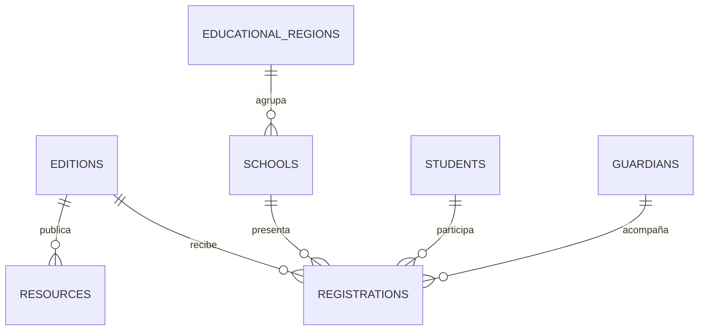

# Modelo inicial de datos OLCOMEP

Fecha: 2026-09-04.

## Relaciones

## Responsabilidad de cada tabla

| Tabla | Responsabilidad |
| --- | --- |
| `editions` | Configuración anual, fechas de inscripción y publicación |
| `resources` | Manuales, reglamentos, cuadernillos, imágenes y enlaces externos |
| `educational_regions` | Catálogo oficial de direcciones regionales educativas |
| `schools` | Centro educativo, circuito, tipo, correo y región |
| `students` | Identidad básica de la persona participante y protección de su identificación |
| `guardians` | Persona tutora responsable y sus medios de contacto |
| `registrations` | Participación del estudiante en una edición, grado, relación, origen y estado |

## Correspondencia con la inscripción masiva 2026

| Campo del archivo | Destino |
| --- | --- |
| Primer apellido, segundo apellido y nombre | `students` |
| Año escolar | `registrations.grade` |
| Sexo biológico y nacionalidad | `students` |
| Cédula o identificación | `students.identification_encrypted`, `identification_hash` y `identification_last_four` |
| Nombre, tipo y correo del centro | `schools` |
| Dirección regional y circuito | `educational_regions` y `schools.circuit_code` |
| Nombre, correo y teléfono de la persona tutora | `guardians` |
| Vínculo con la persona estudiante | `registrations.guardian_relationship` |

## Seguridad y ciclo de vida

- La capa de servicio normalizará identificaciones antes de calcular la huella y cifrará el valor con una clave fuera del repositorio.
- Las respuestas API nunca devolverán `identification_encrypted` ni `identification_hash`.
- Los listados administrativos mostrarán como máximo los cuatro caracteres finales.
- Las eliminaciones quedan restringidas cuando existe una inscripción relacionada.
- La institución debe definir el plazo de retención antes de habilitar inscripciones en producción.

## Decisiones abiertas

- Catálogos definitivos para tipo de institución, relación con la persona estudiante y estados del flujo.
- Proceso de revisión, corrección y aprobación de inscripciones.
- Modelo de resultados y premiación.
- Fuente maestra para centros educativos y códigos oficiales.
